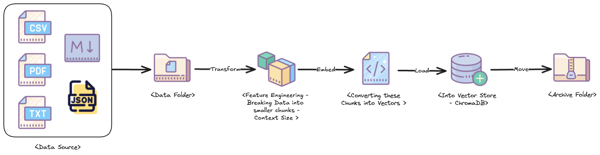
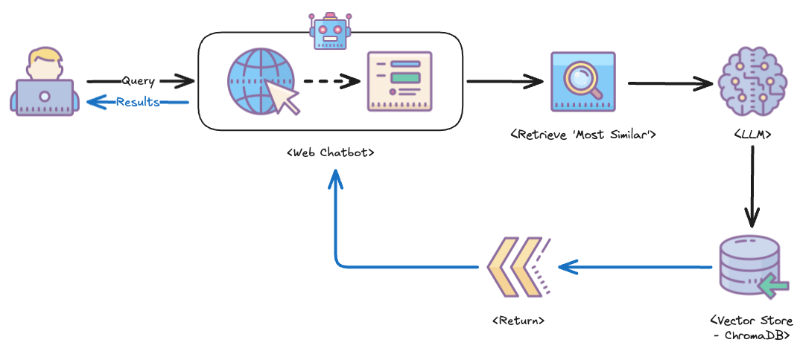
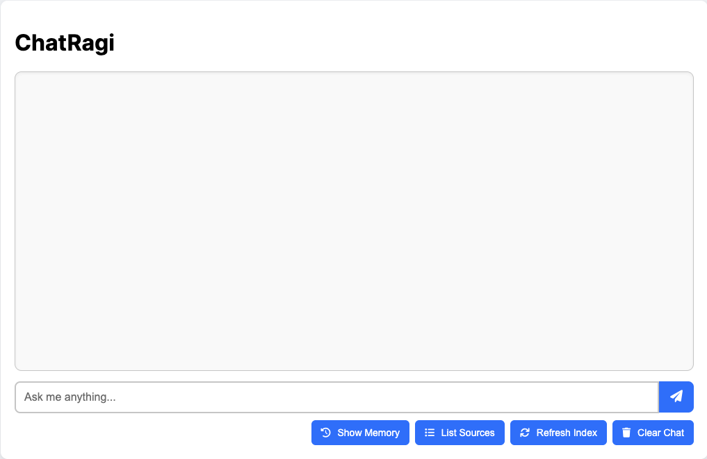

# ChatRagi — AI-Powered Local RAG Chatbot


**ChatRagi** is a fully local **Retrieval-Augmented Generation (RAG)** chatbot that combines **LLM-based embeddings**, **ChromaDB for vector search**, and **Flask** to deliver context-aware responses based on indexed documents and memory.

### Features
- 🔍 **Document Ingestion**: Load and parse PDF, CSV, TXT, JSON, or Markdown files into ChromaDB.
- 💬 **Chat Interface**: Interact with your documents using LLMs and contextual memory.
- 📊 **Embeddings + Retrieval**: Embedding models generate semantic context for smarter search.
- 🔧 **Modular Utilities**: Clean architecture for memory, indexing, chat logic, and error handling.
- 🌐 **Web UI**: Built with HTML, CSS, and JS for local interaction.

---
> 📖 For additional project documentation, refer to the **docs/** folder.

> ⚠️ Before continuing, make sure to complete the setup steps in **[Running LLMs Locally](docs/Running-LLMs-Locally-README.md)** README file to configure **phi4**, **nomic-embed-text**, or any other Ollama-supported open-source model on your local machine.

---
### Project Structure

```bash
chatragi/
├── src/chatragi/         # Core app logic and modules
│   ├── app.py            # Main entry point to run the app
│   ├── config.py         # Global settings (paths, model names, etc.)
│   ├── file_watcher.py   # Watches for new files in /data/
│   ├── utils/            # Logic for chatbot, memory, database, logging
│   ├── templates/        # Flask HTML templates
│   └── static/           # JS and CSS assets
├── chroma_db/            # ✨ Auto-generated: Local ChromaDB vector store
├── data/                 # ✨ Auto-generated: Input files for ingestion
├── archive/              # ✨ Auto-generated: Processed files archive
├── docs/                 # Guides, architecture docs, and setup references
├── notebooks/            # Dev/test notebooks
├── logs/                 # ✨ Auto-generated: Runtime logs
├── storage/              # ✨ Auto-generated: Output and session data
├── test/                 # Unit and integration tests
├── .gitignore
├── .pre-commit-config.yaml
├── pyproject.toml
└── README.md

✨ Note: These folders are created automatically on first run.
```

---
### Setup Instructions

> Built & tested on: 2022 Mac Studio, M1 Max processor, 32 GB RAM

**Clone and install dependencies:**

```shell
git clone https://github.com/your-username/chatragi.git
cd chatragi

# Create and activate a virtual environment
python3 -m venv .venv
source .venv/bin/activate

# Upgrade essential tools
python3 -m pip install --upgrade pip setuptools wheel

# Install project in editable mode
pip install -e .

# (Optional) Install dev tools
pip install -e '.[dev]'
```

---
### Document Ingestion Service

**Run the file watcher to process documents automatically:**
```shell
python3 src/chatragi/file_watcher.py
```

**You should see output similar to:**
```text
INFO - ChatRagi - Successfully connected to ChromaDB!
INFO - ChatRagi - Starting File Watcher Service...
INFO - ChatRagi - Watching ".../chatragi/data" for new files...
```

**How it works:**



- Supported formats: pdf, csv, txt, json, md
- Monitors the data/ folder for new files.
- Validates file integrity before processing.
- Indexes chunks into ChromaDB.
- Moves processed files to the archive/ folder.

To stop the service, press **Ctrl + C**.

For additional details, please refer to **[File Watcher](docs/File-Watcher-README.md)** README file.

---
### Run the Web Chatbot

This module implements the web backend for the ChatRagi chatbot. It sets up several HTTP endpoints to serve the chatbot's home page, process user queries, store conversation memories, refresh the document index, and list stored documents and memories.



**Running the App:**
```shell
python3 src/chatragi/app.py
```

**Sample terminal output:**
```text
INFO - ChatRagi - Refreshing index...
INFO - ChatRagi - Index is ready.
* Running on http://127.0.0.1:5000
```

**Then open your browser and go to:** 🌐 [http://127.0.0.1:5000](http://127.0.0.1:5000)



To stop the Chatbot App, press **Ctrl + C**.

For additional details, please refer to **[App](docs/App-README.md)** README file.

---
**Author:** [Simer Singh Sethi](mailto:simer@disruptivegeek.net)