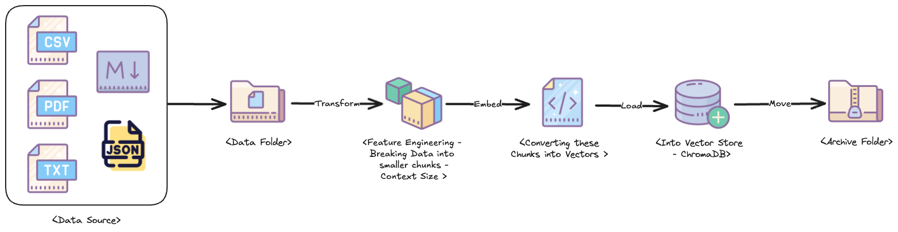
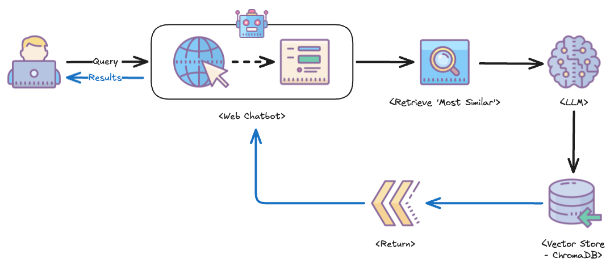
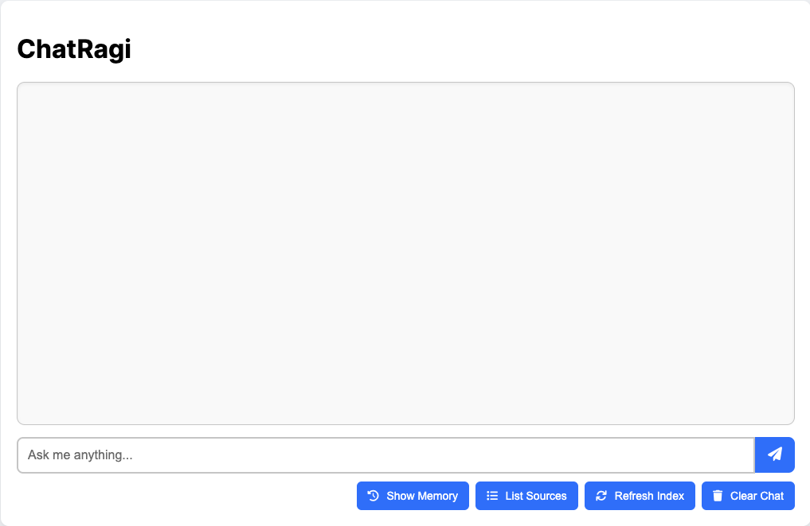

# ChatRagi — AI-Powered Local RAG Chatbot


**ChatRagi** is a fully local **Retrieval-Augmented Generation (RAG)** chatbot framework that integrates LLM-based embeddings, ChromaDB for vector search, and a Flask web app to deliver context-aware responses based on indexed documents and conversational memory.

## Features

- **Document Ingestion**: Parses and indexes PDFs, CSVs, TXT, JSON, and Markdown files into ChromaDB.
- **Chat Interface**: Enables local interaction with your documents using LLMs and memory-aware responses.
- **Embeddings + Retrieval**: Leverages embedding models for semantically rich search.
- **Modular Utilities**: Clean separation for memory, document ingestion, chat logic, and logging.
- **Local Web UI**: A lightweight front end built with HTML, CSS, and JS for interacting with your knowledge base.

---
## Quick Links

> 📖 For additional project documentation, refer to the **docs/** folder.

> ⚠️ Before continuing, make sure to complete the setup steps in **[Running LLMs Locally](docs/Running-LLMs-Locally-README.md)** README file to configure **phi4**, **nomic-embed-text**, or any other Ollama-supported open-source model on your local machine.

---
## Project Structure

```bash
chatragi/
├── src/chatragi/         # Core app logic and modules
│   ├── app.py            # Main entry point to run the app
│   ├── config.py         # Global settings (paths, model names, etc.)
│   ├── file_watcher.py   # Watches for new files in /data/
│   ├── utils/            # Logic for chatbot, memory, database, logging
│   ├── templates/        # Flask HTML templates
│   └── static/           # JS and CSS assets
├── chroma_db/            # ✨ Auto-generated: Local ChromaDB vector store
├── data/                 # ✨ Auto-generated: Input files for ingestion
├── archive/              # ✨ Auto-generated: Processed files archive
├── docs/                 # Guides, architecture docs, and setup references
├── notebooks/            # Dev/test notebooks
├── logs/                 # ✨ Auto-generated: Runtime logs
├── storage/              # ✨ Auto-generated: Output and session data
├── test/                 # Unit and integration tests
├── .gitignore
├── .pre-commit-config.yaml
├── pyproject.toml
└── README.md

# ✨ Note: These folders are auto-generated when the app is run for the first time.
```

---
## Setup Instructions

> **Environment used for development**: Mac Studio (2022), Apple M1 Max, 32 GB RAM, running Visual Studio Code.

### Clone and install dependencies:
```shell
git clone https://github.com/sssethi-dg/chatragi.git
cd chatragi

# Create a virtual environment
python -m venv .venv

# Activate the virtual environment
# On Linux/macOS
source .venv/bin/activate 

# On Windows ✨✨✨
.\venv\Scripts\activate 

# Upgrade essential tools
python -m pip install --upgrade pip setuptools wheel

# Install project in editable mode
pip install -e .

# (Optional) Install dev tools
pip install -e '.[dev]'

# ✨✨✨ Note - If you’re using Windows PowerShell (default in Visual Studio Code), you may need to enable script execution before activating your virtual environment.
Set-ExecutionPolicy -ExecutionPolicy RemoteSigned -Scope CurrentUser

```

**Note for Windows Users** - If you encounter the following error during installation:

```shell
ERROR: Failed to build installable wheels for some pyproject.toml based projects (chroma-hnswlib)
```

This usually means C++ build tools are missing from your system. To fix it:
1. Download and install the [Visual C++ Build Tools](https://visualstudio.microsoft.com/visual-cpp-build-tools).
2.	During installation, select the following components under “Individual Components”:
    - MSVC v143 - VS 2022 C++ x64/x86 build tools (Latest)
    - Windows 11 SDK (10.0.22621.0) (or the latest version available)

Once installed, try running the installation steps again.

---
## Document Ingestion Service

ChatRagi includes a file watcher that automatically processes and indexes new documents placed in the data/ folder.

### Start the service:
```shell
python src/chatragi/file_watcher.py
```

### Sample output:
```text
INFO - ChatRagi - Successfully connected to ChromaDB!
INFO - ChatRagi - Starting File Watcher Service...
INFO - ChatRagi - Watching ".../chatragi/data" for new files...
```

### How it works?



- Supported formats: pdf, csv, txt, json, md
- Monitors the data/ folder for new files.
- Validates file integrity before processing.
- Indexes chunks into ChromaDB.
- Moves processed files to the archive/ folder.

🛑 To stop the service, press **Ctrl + C**.

For additional details, please refer to **[File Watcher](docs/File-Watcher-README.md)** README file.

---
## Web Chatbot

The Flask backend provides several endpoints to power the chatbot UI and RAG logic.



### Start the web app:
```shell
python src/chatragi/app.py
```

### Sample terminal output:
```text
INFO - ChatRagi - Refreshing index...
INFO - ChatRagi - Index is ready.
* Running on http://127.0.0.1:5000
```

🌐 Open your browser: [http://127.0.0.1:5000](http://127.0.0.1:5000)



🛑 To stop the Chatbot App, press **Ctrl + C**.

For additional details, please refer to **[App](docs/App-README.md)** README file.

---
## License

This project is licensed under the MIT License. See the [LICENSE](LICENSE) file for more details.

---
## Maintainer

Developed and maintained by [Simer Singh Sethi](mailto:simer@disruptivegeek.net)