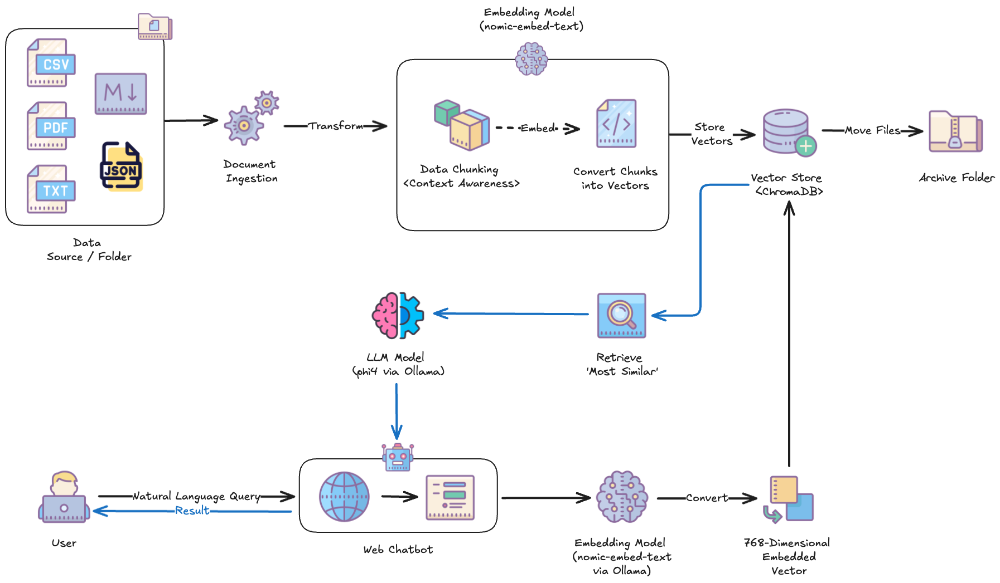
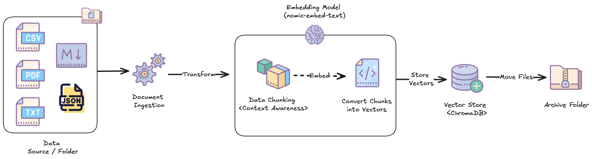
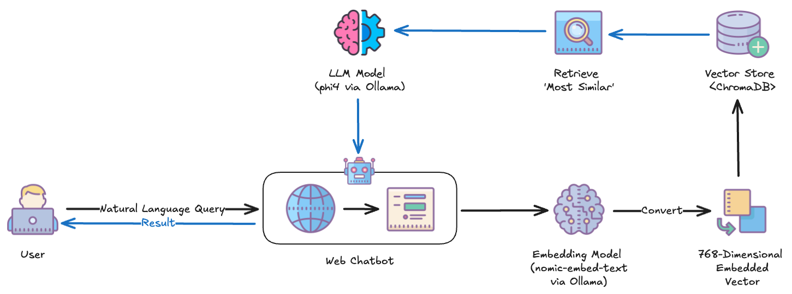
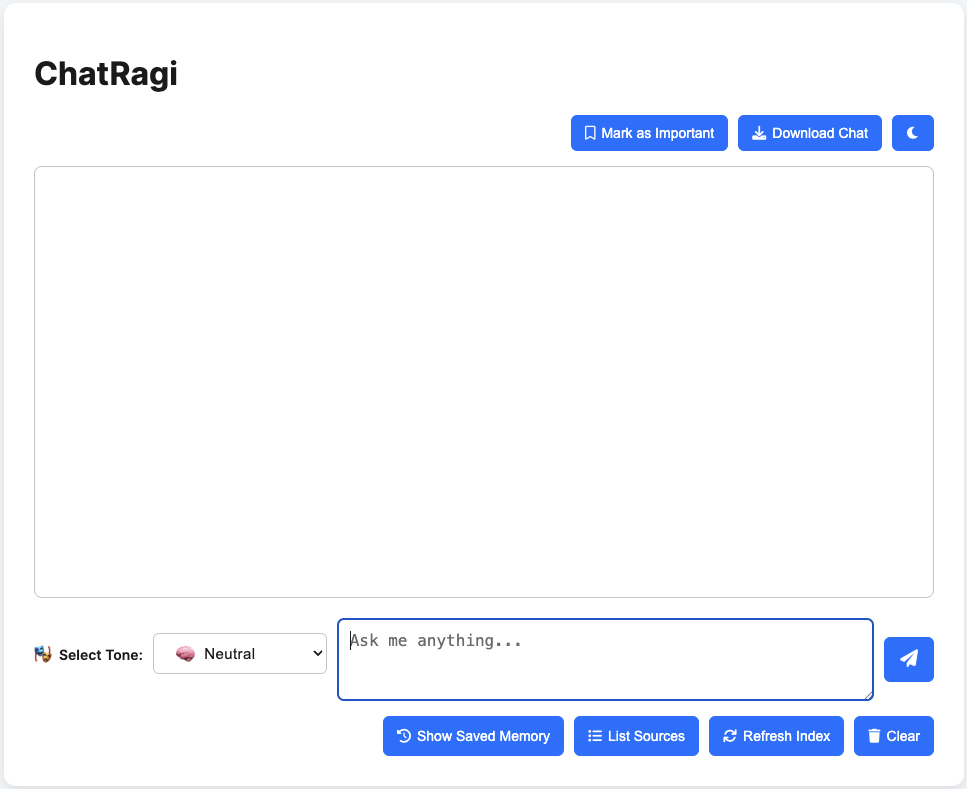

# ChatRagi — AI-Powered Local RAG Chatbot

<p align="right">
  
  
  
  
</p>
<p align="right">
  
  
  
</p>

**ChatRagi** is a fully local **Retrieval-Augmented Generation (RAG)** chatbot framework that integrates local LLMs (via Ollama), ChromaDB for vector search, and a lightweight Flask web app.

It delivers context-aware, memory-augmented responses based on your indexed documents — entirely private, running on your own machine.

---

## Features

- **Document Ingestion**: Parses and indexes PDFs, CSVs, TXT, JSON, and Markdown files into ChromaDB for semantic search.
- **Local Chat Interface**: Chat naturally with your documents through a fast, responsive web UI powered by HTML, CSS, and JavaScript.
- **Embeddings + Retrieval**: Leverages local embedding models (e.g., `nomic-embed-text`) for meaningful, context-rich retrieval.
- **Persona Tone Support**: Choose how ChatRagi responds — 🧠 Neutral, 💼 Professional, or 😄 Witty — dynamically from the chat interface.
- **Memory-Aware Conversations**: Recalls relevant previous interactions to enrich answers where needed.
- **Fully Modular Design**: Clean separation of ingestion, memory, chatbot logic, and backend services for easy customization.
- **100% Local Execution**: All document processing, embeddings, vector storage, and LLM answering happen locally — no cloud dependencies.

---

## ChatRagi System Overview

ChatRagi is a fully local Retrieval-Augmented Generation (RAG) system that allows you to chat with your own documents in natural language — powered entirely by local models and vector search.

The diagram below shows the core components of the system, from document ingestion and semantic indexing to memory-aware querying and tone-controlled response generation.



> **Diagram**: End-to-end architecture of ChatRagi's local RAG pipeline — from document ingestion and embedding to semantic search, prompt construction, and LLM-powered response generation.

---

### How It Works

#### Part 1: Document Ingestion & Indexing

1. **Drop files into `/data/`**  
   - Add PDFs, JSON, TXT, CSV, or Markdown files to the `data/` folder.  
   - ChatRagi continuously monitors this folder and detects new files in real-time.
2. **Chunk, Embed, Store, and Archive**  
   - Each file is parsed and split into smaller, meaningful chunks.  
   - These chunks are embedded into 768-dimensional vectors using a local model (e.g., `nomic-embed-text` via Ollama).  
   - The resulting vectors are stored in **ChromaDB**, the local vector database.  
   - Once processed, the original files are automatically moved to the `archive/` folder to prevent duplicate ingestion and keep your workspace clean.

#### Part 2: Querying the Chatbot & Generating Answers

3. **User submits a query**  
   - The question is converted into an embedding and used to semantically search ChromaDB for the most relevant document chunks.
4. **Context + Persona = Smart Prompt**  
   - Relevant past memories (if available) and top-matching document chunks are combined with the current query.  
   - If a response tone is selected — 🧠 Neutral, 💼 Professional, or 😄 Witty — it's applied here before sending the prompt to the LLM.
5. **Answer generated by local LLM**  
   - The full prompt is passed to a local language model (e.g., `phi4`) via Ollama.  
   - The LLM generates a clean, context-aware Markdown response, which is rendered directly in the Web UI.

> ⚡ Everything runs fully offline — no cloud APIs, no data leakage, and complete control over your knowledge base.

---

## Quick Links

> ⚡ Refer to [Running LLMs Locally](docs/Running-LLMs-Locally-README.md) for instructions on configuring `phi4`, `nomic-embed-text`, or a custom model of your choice.  
> 📖 See the [Architecture Overview](docs/architecture.md) for system diagrams and design details.  
> 🐞 Review [Known Issues](KNOWN_ISSUES.md) for limitations and open bugs.  
> ✍️ Setup instructions are in the [Setup Instructions](#setup-instructions) section below.

---

## Project Structure

```bash
chatragi/
├── src/                      # Core Python application logic
│   └── chatragi/         
│       ├── app.py             # Main entry point to run the Flask app
│       ├── config.py          # Global settings (paths, model names, etc.)
│       ├── file_watcher.py    # Watches for new documents added to /data/
│       ├── cli.py             # Command Line Interface for ChatRagi (optional)
│       ├── utils/             # Modular utilities and helper functions
│       │   ├── chat_memory.py
│       │   ├── chatbot.py
│       │   ├── db_utils.py
│       │   ├── document_loader.py
│       │   ├── error_handler.py
│       │   ├── logger_config.py
│       │   └── persona.py
│       ├── templates/         # HTML templates for Flask Web UI      
│       │   └── index.html        
│       └── static/            # Frontend static assets (CSS, JS)
│           ├── css/
│           │   └── styles.css
│           └── js/
│               └── scripts.js
├── chroma_db/                 # ✨ Auto-generated: Local ChromaDB vector store
├── data/                      # ✨ Auto-generated: Input files for ingestion
├── archive/                   # ✨ Auto-generated: Processed files archive
├── docs/                      # Guides, architecture diagrams, and setup instructions
├── notebooks/                 # Development and testing notebooks
├── logs/                      # ✨ Auto-generated: Runtime logs
├── storage/                   # ✨ Auto-generated: Output and chatbot memory storage
├── test/                      # Unit and integration tests
├── .gitignore
├── .pre-commit-config.yaml
├── pyproject.toml
├── README.md/
├── CHANGELOG.md
└── LICENSE

# ✨ Note: Folders like /chroma_db, /data, /archive, /logs, and /storage
# are auto-created the first time you run the app.
```

---

## Setup Instructions

### Prerequisites:
Before you begin, make sure the following are installed on your system:

| **Tool**             | **Recommended Version / Notes**                                                      |
| -------------------- | ------------------------------------------------------------------------------------ |
| **Python**           | 3.11.8 or higher (64-bit)                                                            |
| **IDE / Editor**     | Visual Studio Code (or equivalent)                                                   |
| **Terminal / Shell** | Bash, PowerShell, or zsh (virtualenv support)                                        |
| **Ollama**           | Must be installed and running locally ([Guide](docs/Running-LLMs-Locally-README.md)) |
| **Git** (optional)   | For cloning and managing the repository                                              |

> 💡 You can verify Python installation using `python --version` or `python3 --version`.  
> 🛠️ You can also use tools like `pyenv` to manage multiple Python versions.  

### Development Environment Used:

> 🖥️ **Mac Studio (2022)** — Apple M1 Max, 32 GB RAM  
> 🛠️ **IDE**: Visual Studio Code  
> 🧠 **Optimized for local LLMs via Ollama**, with:
> - Fast embeddings using `nomic-embed-text` (768-dim)
> - Low-latency responses via `phi4`
> - No Docker GPU acceleration (Apple Silicon limitation), so tuned for efficient context handling and minimal I/O overhead

> 💡 **Performance Tip**  
>> If you're running on a lower-spec device, try a smaller model like: `llama3.2:3b`. This loads faster and lets you test functionality before switching to larger models like `phi4:14b`. 
>> See [Running LLMs Locally](docs/Running-LLMs-Locally-README.md) and [Configuration Overview](Config-README.md) for detailed setup instructions.

---

### 1. Clone the repository and create a virtual environment

```bash
git clone https://github.com/sssethi-dg/chatragi.git
cd chatragi

# Create a virtual environment
python3 -m venv .venv

# 💡 Tip: On Windows, use `python` instead of `python3` if you encounter an error
python -m venv .venv
```

### 2. Activate the virtual environment

**On macOS / Linux:**
```bash
source .venv/bin/activate
```

**On Windows (CMD or PowerShell):**
```bash
.\venv\Scripts\activate
```
> ⚠️ PowerShell Users:
> If you encounter a script execution error, run the following command first:
```powershell
Set-ExecutionPolicy -ExecutionPolicy RemoteSigned -Scope CurrentUser
```
**If activation still fails:**
```powershell
# Manually navigate to the Scripts directory
cd .venv\Scripts
.\activate
cd ../..  # Return to project root
```
> 💡 Pro Tip for Git Bash users:
> The activation syntax is slightly different:
```bash
source .venv/Scripts/activate
```

### 3. Upgrade pip and install dependencies

```bash
python -m pip install --upgrade pip setuptools wheel

# Install project in editable (development) mode
pip install -e .

# (Optional) Install developer tools
pip install -e '.[dev]'
```

### Windows Users — Troubleshooting Chroma Installation

```bash
ERROR: Failed to build installable wheels for some pyproject.toml based projects (chroma-hnswlib)
```

It usually means C++ build tools are missing. To fix it:
1.	Download and install the [Visual C++ Build Tools](https://visualstudio.microsoft.com/visual-cpp-build-tools/).
2.	During installation, select the following Individual Components:
	•	✅ MSVC v143 – VS 2022 C++ x64/x86 build tools (Latest)
	•	✅ Windows 11 SDK – Version 10.0.22621.0 or latest available
3.	After installation, re-run the pip install commands.

---
## Part 1: Document Ingestion Service

ChatRagi includes a lightweight file watcher that continuously monitors the `data/` folder for new documents.

When a supported file is added, it’s automatically parsed, embedded, and indexed into ChromaDB — no manual steps required.

### Start the service

```shell
python src/chatragi/file_watcher.py
```

### Add new files

Once the service is running, copy or move your documents into the data/ folder:
```bash
# Move or copy your file into the data/ folder
cp /path/to/my-notes.pdf data/
```

> Supported formats: .pdf, .csv, .txt, .json, .md

ChatRagi will detect the new file, process it in real-time, and log the output.

### Sample output

```text
INFO - ChatRagi - Successfully connected to ChromaDB!
INFO - ChatRagi - Starting File Watcher Service...
INFO - ChatRagi - Watching ".../chatragi/data" for new files...
INFO - ChatRagi - Detected new file: my-notes.pdf
INFO - ChatRagi - Processed and indexed: my-notes.pdf
INFO - ChatRagi - Moved file to archive/
```

### How It works



> **Diagram**: ChatRagi’s real-time document ingestion pipeline — monitors the `/data/` folder, chunks and embeds content using a local model, stores vectors in ChromaDB, and archives the original files after processing.

1. **Monitor the data folder**  
   The file watcher continuously observes the `data/` folder for new files in real time.
2. **Validate file readiness**  
   It checks that each file is stable (not still being written) and skips hidden/system files like `.DS_Store`.
3. **Parse and chunk the content**  
   Once validated, documents are parsed and broken into context-aware chunks optimized for embedding.
4. **Generate vector embeddings**  
   Each chunk is passed to the local `nomic-embed-text` model (via Ollama) and transformed into a 768-dimensional vector.
5. **Store and archive**  
   Vectors are stored in ChromaDB, and the original file is moved to the `archive/` folder to prevent re-processing.

> 🛑 To stop the service, press Ctrl + C.

For additional details, please refer to **[File Watcher](docs/File-Watcher-README.md)** README file.

---

##  Part 2: Web Chatbot (Flask App)

ChatRagi includes a local web-based chatbot powered by Flask that lets you chat with your documents through a lightweight UI — no login or cloud setup required.



> **Diagram**: ChatRagi’s query handling pipeline — takes user input, embeds the query using nomic-embed-text, retrieves relevant vectors from ChromaDB, and passes context to a local LLM (like phi4) to generate a Markdown response in the Web UI.

### Start the web app

Run the following command from your project root:
```shell
python src/chatragi/app.py
```

### Sample terminal output

```text
INFO - ChatRagi - Refreshing index...
INFO - ChatRagi - Index is ready.
* Running on http://127.0.0.1:5000
```

### Access the chat interface

Open your browser and go to:
[http://127.0.0.1:5000](http://127.0.0.1:5000)

> 🛑 To stop the Chatbot App, press **Ctrl + C**.

For additional details, please refer to **[App](docs/App-README.md)** README file.

---

## Using the ChatRagi Web App

Once the app is running, you'll see the ChatRagi interface in your browser.



> **Screenshot**: The ChatRagi Web App interface — includes a tone selector, input field, send button, and interactive controls to mark important responses, download chat, view memory, list sources, refresh the index, and clear the chat window.

### Web App Controls

**Top Right Buttons**
- **Mark as Important** — Flags the latest Q&A for future reference.
- **Download Chat** — Saves the chat session to a `.txt` file.
- **Toggle Dark Mode** — Switch between light and dark UI themes.

**Bottom Action Buttons**
- **Show Saved Memory** — View your past questions and answers.
- **List Sources** — See all documents that have been indexed.
- **Refresh Index** — Re-ingest files from the data/ folder.
- **Clear** — Clears the current conversation and input field.

### Ask a question

- Enter your question in the input box.
- Click the **Send** button (📤).
- ChatRagi will search your documents and return a structured answer.

### Select Response Tone

Use the **Select Tone** dropdown to customize how ChatRagi responds:

- 🧠 **Neutral** — Balanced, clear, and helpful.
- 💼 **Professional** — Formal, structured, and business-friendly.
- 😄 **Witty** — Playful, clever, and conversational.

> Your tone choice affects the phrasing, not the facts.
> The underlying response saved to memory is always the neutral version.

💡 **Tip**: Try asking the same question in different tones — the style shifts, but the meaning remains consistent.

### What Happens Behind the Scenes

1. You submit a natural language query.
2. The query is embedded using `nomic-embed-text` (768-dim vector via Ollama).
3. ChromaDB is searched for semantically similar chunks.
4. Relevant chunks and any memory context are merged to form a structured prompt.
5. The local LLM (e.g., `phi4`) generates a Markdown-formatted response.
6. The response is returned and displayed in the UI.

> 💡 If sources are cited, filenames will appear beneath the response — ensuring transparency.

---

## Contribution Status

> ⚠️ This repository is currently **read-only**.  
> Contributions, issues, and pull requests are disabled until a future release.  
> Feel free to clone, explore, and use the project locally!  

---

## License

This project is licensed under the MIT License. See the [LICENSE](LICENSE) file for more details.

---

## Maintainer

Developed and maintained by [Simer Singh Sethi](mailto:simer@disruptivegeek.net)

If you find **ChatRagi** helpful and want to support continued development:

[](https://buymeacoffee.com/sssethi)

Your support helps keep the dev caffeine flowing!