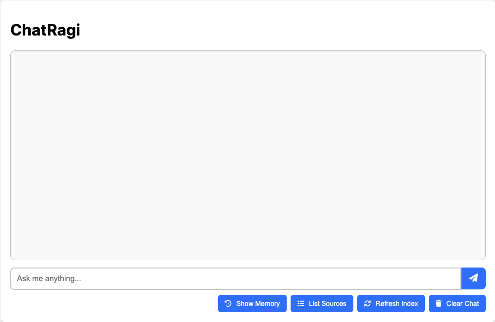

# Web Application Backend (app.py)

The **app.py** module serves as the Flask backend for ChatRagi. It provides API endpoints and HTML rendering for interacting with the chatbot, managing document indexing, storing conversation memory, and handling query-response cycles.

This module is the main entry point for running the web server.

---
## Core Responsibilities

- Serve the chatbot frontend (`index.html`)
- Handle incoming user questions and route them to the AI engine
- Store query-response pairs for memory-aware interaction
- Refresh document embeddings and vector index
- Expose endpoints to list stored documents and conversation logs

---
## Routes and Endpoints

### `GET /`

Renders the homepage interface using `templates/index.html`. This is the frontend where users type and submit their questions.

### `POST /ask`

Processes a user query and returns a Markdown-formatted AI response.

- Accepts JSON: `{ "question": "..." }`
- Returns JSON: `{ "answer": "..." }`
- Internally, this uses the AI engine to:
  - Retrieve context from ChromaDB
  - Generate a response using an LLM (via  LlamaIndex)
  - Store the interaction in the memory database

### `GET /list-documents`

Returns a list of filenames of all documents currently indexed in ChromaDB.

```json
{
  "documents": ["file1.pdf", "notes.txt", ...]
}
```
`
### **`GET /list-memories`**

Returns stored chatbot interactions (query/response pairs).

```json
{
  "memory": [
    {
      "question": "What is data governance?",
      "response": "Data governance is..."
    },
    ...
  ]
}
```

### **`POST /refresh-index`**

Triggers a refresh of the vector index using existing documents from storage. This ensures the LLM has access to newly ingested files.

---
## Logging

The app uses a centralized logging system (configured in logger_config.py) to log important runtime events, incoming requests, and errors. Logs are saved in the logs/ directory.

---
## Exception Handling

All endpoints are wrapped in a custom error handler that returns structured JSON error responses to clients, aiding in frontend error display and debugging.

---
## Start the webb app

```shell
python3 src/chatragi/app.py
```

### Sample terminal Output:
```text
INFO - ChatRagi - Refreshing index...
INFO - ChatRagi - Index is ready.
* Running on http://127.0.0.1:5000
```

Visit [http://127.0.0.1:5000](http://127.0.0.1:5000) in your browser.



To stop the Chatbot App, press **Ctrl + C**.

---
### Development Notes

- API responses are Markdown-formatted to support rich text rendering in the frontend.
- Conversation memory is stored in ChromaDB with session metadata.
- Index refresh logic is managed via llama_index integration.
- To customize models or memory behavior, update chatbot.py and chat-memory.py.

---
## Summary

The web backend provides the glue between ChatRagi’s user interface, its vector store (ChromaDB), and local language models. It’s designed to be lightweight, extensible, and production-ready with robust logging, error handling, and a clean API surface.