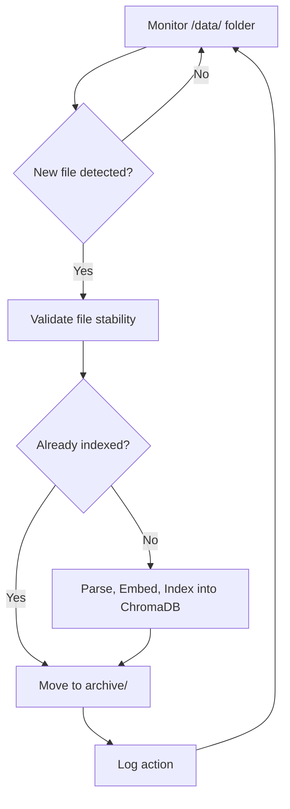

# File Watcher — Automated Document Ingestion for ChatRagi

The `file_watcher.py` service continuously monitors the `/data/` folder and automatically processes new documents for indexing into ChromaDB.

It ensures file stability, avoids duplicate ingestion, and archives processed files — keeping your local knowledge base fresh with no manual steps.

---

## What It Does

- Monitors the `data/` folder for new or updated files in real time
- Validates that files are complete, stable, and valid
- Parses, chunks, embeds, and indexes documents into ChromaDB
- Moves processed files into the `archive/` folder to prevent re-processing
- Logs each ingestion event, warning, or error for transparency

---

## Tech Stack

- [`watchdog`](https://pypi.org/project/watchdog/): File system monitoring
- `ChromaDB`: Local vector database for semantic search
- Python standard libraries: `os`, `pathlib`, `uuid`, `shutil`, `time`, `logging`

---

## How It Works



> **Diagram**: Real-time ingestion cycle — from file detection and validation to embedding, storage, and archiving.

---

## Folder Paths
Configured centrally in `config.py`:

| Purpose           | Default Path |
| ----------------- | ------------ |
| Data Watch Folder | `data/`      |
| Archive Folder    | `archive/`   |
| Vector Store (DB) | `chroma_db/` |
| Logging Output    | `logs/`      |

> 💡 These folders are created at runtime if they don’t already exist.

---

## Supported File Types

- `.pdf`
- `.csv`
- `.json`
- `.txt`
- `.md`

---

## How to Run the Service

From your project root:
```bash
python src/chatragi/file_watcher.py
```

---

## Sample Output

```text
INFO - ChatRagi - Successfully connected to ChromaDB!
INFO - ChatRagi - Starting File Watcher Service...
INFO - ChatRagi - Watching ".../chatragi/data" for new files...
INFO - ChatRagi - Detected new file: my-notes.pdf
INFO - ChatRagi - Processed and indexed: my-notes.pdf
INFO - ChatRagi - Moved file to archive/
```

> 🛑 To stop the service, press Ctrl + C.

---

## File Safety and Validation
- Skips temporary, hidden, or system files (e.g., `.DS_Store`, partial downloads)
- Waits until files are stable (not growing or changing) before starting ingestion
- Archives processed files to avoid duplication
- Logs all warnings, failures, and successful actions to `/logs/`

---

## Developer Notes
- File validation handled by `is_valid_file()`
- Document ingestion logic in `document_loader.py`
- Logging configured in `logger_config.py`
- Designed for future extensibility (e.g., remote/cloud ingestion)

---

## Summary

The File Watcher is a core automation layer of **ChatRagi**.  
It keeps your local vector store fresh by automatically ingesting, indexing, and archiving documents - with zero manual steps.

Simply drop a supported file into `/data/`, and ChatRagi handles the rest.

The File Watcher is a core automation layer of **ChatRagi**.