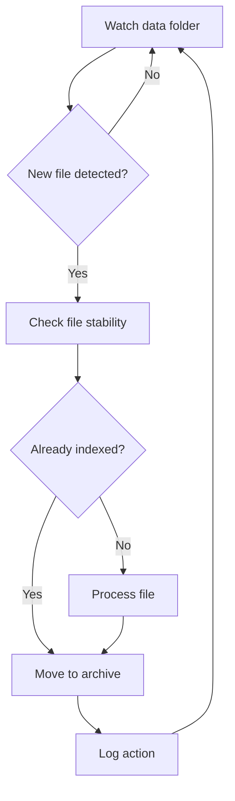

# File-Watcher – Automated Document Ingestion for ChatRagi

**file_watcher.py** is a background service for ChatRagi that watches a designated folder (e.g. **/data/**) and automatically processes new files for indexing into ChromaDB. It ensures files are stable, unique, and successfully archived after ingestion to prevent duplication.

---
## What It Does

- **Monitors a folder** (e.g., `data/`) for new or updated document files
- **Validates** that files are fully written and not hidden/system files
- **Processes** valid documents using ChatRagi’s embedding + indexing pipeline
- **Archives** processed files to avoid re-processing
- **Logs** every major step, warning, and exception

---
## Tech Stack

- [`watchdog`](https://pypi.org/project/watchdog/): File system monitoring
- `ChromaDB`: Local vector store for embeddings
- Python standard libraries: `os`, `shutil`, `time`, `uuid`, `pathlib`, `logging`

---
## Workflow Overview



  ---
## Folder Paths
These are configured in config.py:

|**Purpose**|**Default Path**|
|---|---|
|Data Watch Folder|data/|
|Archive Folder|archive/|
|Vector Store (DB)|chroma_db/|
|Logging Output|logs/|
> 💡 These folders are created at runtime if they don’t already exist.

---
## Supported File Types

- .pdf
- .csv
- .json
- .txt
- .md

---
## How to Run

```shell
python src/chatragi/file_watcher.py
```

### Sample Output:
```text
INFO - ChatRagi - Successfully connected to ChromaDB!
INFO - ChatRagi - Starting File Watcher Service...
INFO - ChatRagi - Watching ".../chatragi/data" for new files...
```

---
## File Safety and Validation

- Skips hidden files (e.g. .DS_Store, temp files)
- Waits for files to stop changing before processing
- Logs all warnings/errors for debugging (logs/)

---
## Developer Notes

- Validation logic can be found in is_valid_file()
- Ingestion pipeline handled by document_loader.py
- Logging is managed via logger_config.py
- Supports extension to remote sources (e.g., cloud storage)

---
## Summary

This script is a key component of **ChatRagi’s** RAG pipeline. It keeps your local knowledge base fresh, without needing a manual trigger every time you add a file. Drop a doc in /data/, and the system takes care of the rest.