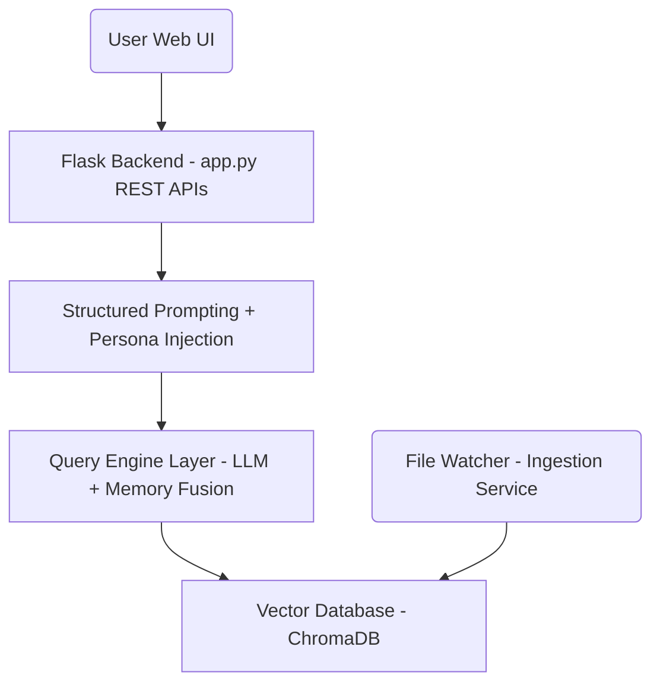
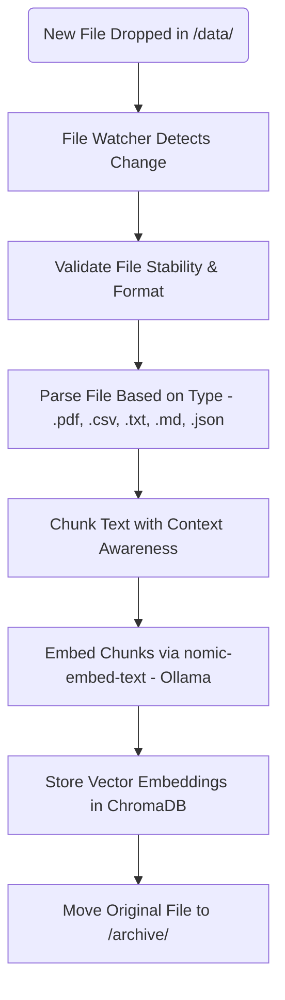
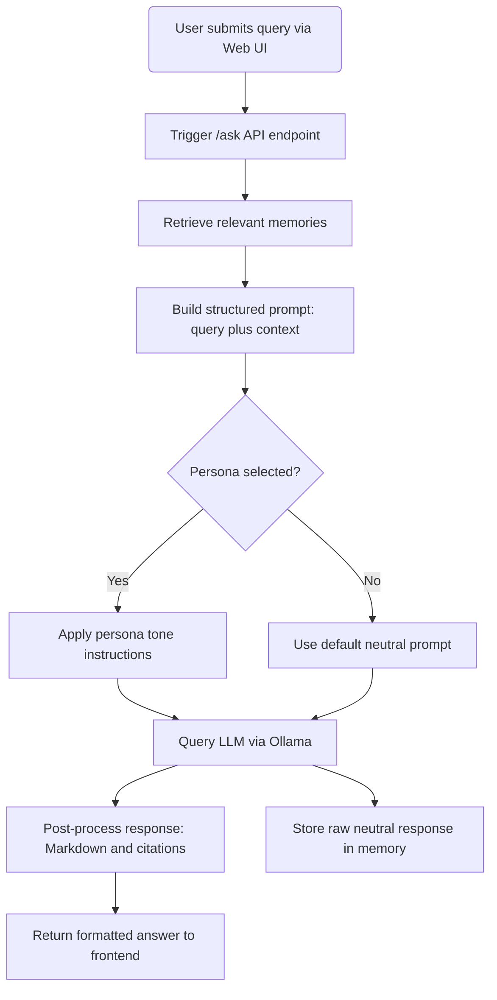
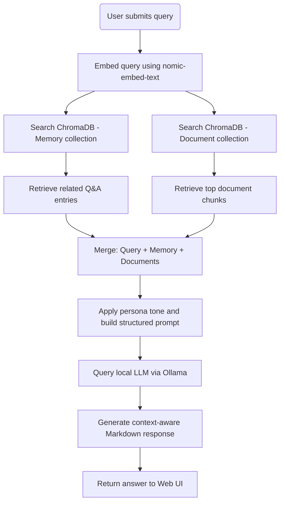
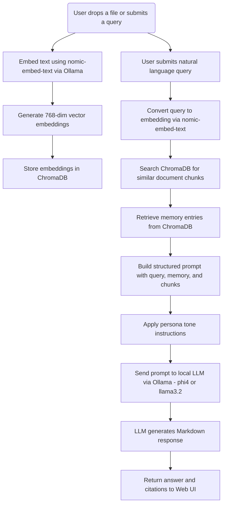

# ChatRagi Architecture Overview

Welcome to the technical architecture guide for **ChatRagi** — a fully local Retrieval-Augmented Generation (RAG) system that runs on your own machine.

This document outlines the core components, data flow, and how ChatRagi integrates document ingestion, local vector storage, and persona-aware LLM responses using structured prompts.

---

## 1. System Components

ChatRagi is composed of the following layers:
- A browser-based **Web UI** for chat interaction
- A Flask-based backend that handles routing, structured prompting, and persona tone injection
- A background **document ingestion service** that watches the `/data` folder, parses new files, and stores embedded chunks in the vector database
- A vector database (ChromaDB) for fast semantic retrieval of both documents and memory
- Local embedding and LLM models (served via Ollama) for processing queries and generating responses

> **Diagram**: High-level layout of ChatRagi’s architecture — connecting the Web UI, Flask backend, structured prompting, local LLMs, and ChromaDB.

> 💡 **Note:** The document ingestion service (`file_watcher.py`) runs as a separate background process.  
> It continuously monitors the `/data/` folder for new files, parses and chunks their content, generates embeddings via `nomic-embed-text`, and stores them in ChromaDB — all without restarting the app.

---

## 2. Document Ingestion Flow

This flow outlines how ChatRagi processes documents dropped into the `data/` folder and prepares them for retrieval.

> **Diagram**: Document ingestion workflow — from file detection and validation to chunking, embedding via `nomic-embed-text`, storage in ChromaDB, and archival.

> 🔁 The ingestion service runs independently in the background and connects directly to ChromaDB for storage.

---

## 3. Query Flow with Persona Prompting

This section illustrates what happens when a user submits a question through the ChatRagi interface.

The query is routed to the Flask backend via the `/ask` endpoint, where the system:
- Retrieves context from memory (if available)
- Constructs a structured prompt using the selected tone
- Submits the prompt to the local LLM (e.g., `phi4` via Ollama)
- Post-processes the response and returns it to the frontend

> 💡 Importantly, persona tone only affects **how** the answer is worded — not the facts. The raw response is always saved in neutral tone to maintain retrieval consistency.

> **Diagram**: ChatRagi’s /ask endpoint flow — user query is enriched with memory and persona style before querying the LLM. The system formats the response for the frontend and stores the neutral version in memory for consistency.

---

## 4. Dual Retrieval: Memory + Documents

> **Diagram**: ChatRagi retrieves both memory and document context in parallel, merges them with the user query, applies persona tone, and generates a response using a local LLM.

This flow illustrates how ChatRagi performs dual retrieval — pulling both relevant past interactions (memory) and document content to enrich its answers.
1. The user submits a natural language query.
2. The query is embedded into a 768-dimensional vector using the nomic-embed-text model via Ollama.
3. In parallel:
	- The memory collection in ChromaDB is searched for semantically related Q&A entries.
	- The document collection is searched for relevant chunks of ingested content.
4. Retrieved memory and document chunks are merged with the original query.
5. If a persona tone is selected (Neutral, Professional, Witty), it is applied at this stage.
6. A structured prompt is built and sent to a local LLM (e.g., phi4 or llama3.2).
7. The LLM generates a Markdown-formatted response, which is returned to the frontend.
8. The neutral version of the response is optionally stored in memory for future context.

> 🔁 This dual-retrieval strategy improves response quality by combining long-term memory with document grounding — all while running fully offline.

---

## 5. Local Model Flow: Embeddings + LLM via Ollama

> **Diagram**: ChatRagi uses two local models via Ollama — one for generating query/document embeddings (nomic-embed-text), and another for generating answers (phi4 or llama3.2). This flow combines vector search, memory retrieval, and persona-tuned prompting to produce final responses.

ChatRagi uses two local Ollama models during query processing:
- `nomic-embed-text` — generates 768-dimension embeddings for documents and queries
- `phi4` or `llama3.2` — generates final conversational responses

When a user submits a query, it is:
1. Embedded using `nomic-embed-text` to generate a vector.
2. Used to retrieve both:
	- Relevant chunks from the vector database (ChromaDB)
	- Past conversation memory entries (if applicable)
3. Combined into a structured prompt and enhanced with the selected persona tone.
4. Sent to a local LLM (e.g., `phi4`), which returns a Markdown-formatted response and optional citations.

**Summary of Query Embedding Step:**

| **Step**                 | **Component**               |
| ------------------------ | --------------------------- |
| Query → Embedding        | nomic-embed-text via Ollama |
| Embedding → Search       | ChromaDB (vector DB)        |
| Retrieval → Prompt Build | Prompt + Persona tone       |
| Prompt → Answer          | Local LLM (phi4, llama3.2)  |

---

## Notes

- ChatRagi is **100% local-first** — no cloud APIs, no external calls.
- **Persona tone injection** occurs during prompt construction, before LLM execution.
- All conversational memory is stored in **neutral tone** for consistent retrieval.
- **ChromaDB** serves as the vector store for both document chunks and chat memory.

---

## Summary

ChatRagi’s architecture is designed for modularity, privacy, and full offline execution.

It emphasizes:
- Fast ingestion and retrieval via local document watching and vector search
- Persona-aware structured prompting for tailored LLM outputs
- Clean separation of UI, memory, logic, and model services

These design patterns make the system easy to extend, maintain, and customize for personal or enterprise-level RAG applications.
